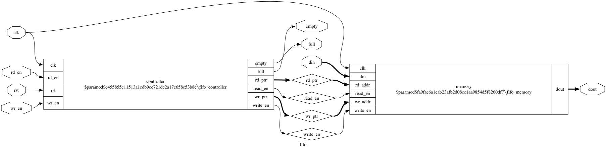
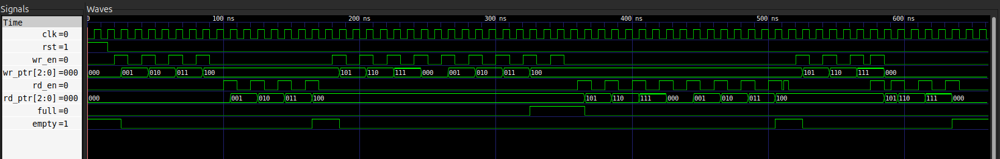
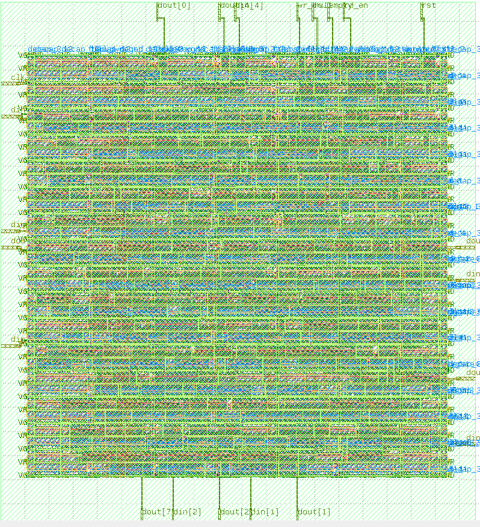
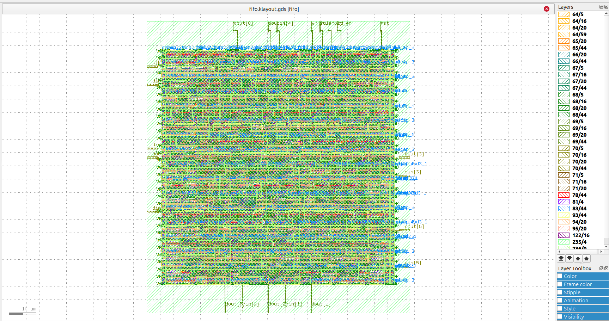
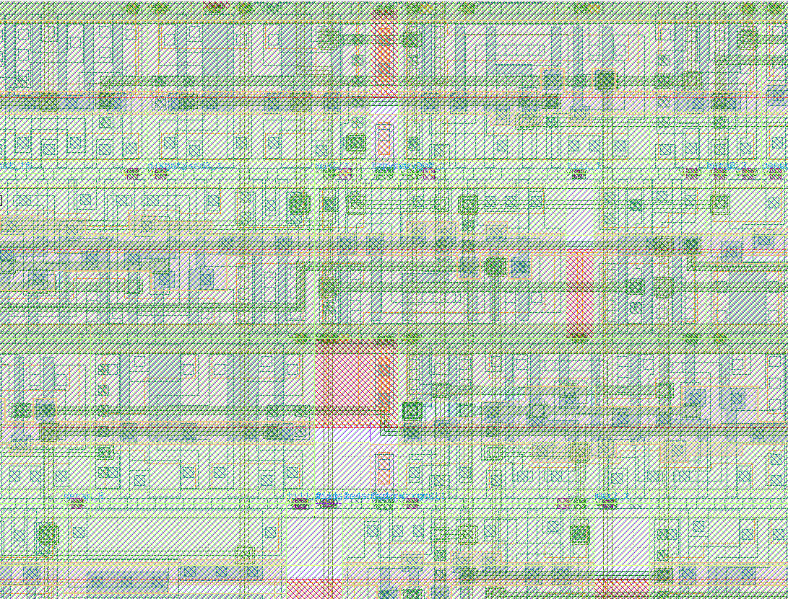

<div align="center">

# 🚀 Parameterized Synchronous FIFO ASIC Implementation

### Complete RTL-to-GDSII Flow using OpenLane 2 and SkyWater SKY130


</div>

---

# 📖 Overview

This project implements a **parameterized synchronous FIFO (First-In First-Out)** in **Verilog HDL** and demonstrates the complete **RTL-to-GDSII ASIC implementation flow** using **OpenLane 2** and the **SkyWater SKY130 Open PDK**.

The design was:

- Designed in Verilog RTL
- Functionally verified using Icarus Verilog and GTKWave
- Synthesized using Yosys
- Physically implemented using OpenLane 2/OpenROAD
- Verified using Static Timing Analysis (STA)
- Successfully passed DRC and LVS
- Generated as a manufacturable GDSII layout

This project was completed as part of my ASIC Design learning journey to gain practical experience with the complete digital ASIC implementation flow.

---

# ✨ Features

- Parameterized synchronous FIFO
- Modular RTL architecture
- Separate FIFO controller and memory modules
- Full and Empty flag generation
- Functional verification
- Logic synthesis
- Complete RTL-to-GDSII implementation
- Timing closure achieved
- DRC Clean
- LVS Clean

---

# 🛠 Tools Used

| Tool | Purpose |
|------|---------|
| Verilog HDL | RTL Design |
| Icarus Verilog | Functional Simulation |
| GTKWave | Waveform Analysis |
| Yosys | Logic Synthesis |
| OpenLane 2 | RTL-to-GDSII Flow |
| OpenROAD | Physical Design |
| KLayout | Layout Visualization |
| SKY130 PDK | ASIC Technology |

---

# 🔍 Design Visualization

### RTL Graph

<p align="center">
    
</p>

### Synthesized Netlist

<p align="center">
    
</p>

---

# 📊 Implementation Results

| Metric | Result |
|---------|--------|
| Technology | SkyWater SKY130 |
| Standard Cells | **520** |
| Sequential Cells | **82** |
| Combinational Cells | **190** |
| Cell Area | **4902.2 µm²** |
| Core Area | **7567.26 µm²** |
| Die Area | **10714.6 µm²** |
| Core Utilization | **64.78%** |
| Total Wire Length | **7316 µm** |
| Routed Nets | **423** |
| Total Vias | **2509** |
| Estimated Total Power | **2.03 mW** |
| Setup Violations | **0** |
| Hold Violations | **0** |
| DRC | ✅ PASS |
| LVS | ✅ PASS |

---

# 🧪 Functional Verification

The RTL was verified using **Icarus Verilog** and visualized using **GTKWave**.

The verification covered:

- Reset operation
- FIFO write operation
- FIFO read operation
- Write pointer increment
- Read pointer increment
- FIFO Full condition
- FIFO Empty condition

<p align="center">
    
</p>

---

# 🏗 Physical Implementation

## Final Floorplan

<p align="center">
    
</p>

The floorplan generated by OpenLane after floorplanning and placement.

---

## Final Layout

<p align="center">
    
</p>

Final routed ASIC layout generated after placement, clock tree synthesis, routing, and verification.

---

## Routing Close-Up

<p align="center">
    
</p>

Zoomed view showing standard cells, metal routing, vias, and interconnect layers.

---

# 📂 Repository Structure

```text
fifo-rtl-to-gds/
│
├── rtl/                Verilog RTL
├── tb/                 Testbench
├── scripts/            Yosys synthesis script
├── synth/              Synthesized netlist
├── openlane/           OpenLane configuration
├── results/            Implementation reports
├── graphs/             RTL & synthesized graphs
├── images/             Project images
└── README.md
```

---

# ▶️ Reproducing the Project

### Clone the repository

```bash
git clone https://github.com/<your-username>/fifo-rtl-to-gds.git
cd fifo-rtl-to-gds
```

### Functional Simulation

```bash
iverilog -o fifo_sim rtl/*.v tb/fifo_tb.v
vvp fifo_sim
gtkwave fifo.vcd
```

### Logic Synthesis

```bash
yosys scripts/synth.ys
```

### ASIC Implementation (OpenLane)

```bash
cd openlane
python3 -m openlane config.json
```

---

# 📈 Future Improvements

- Asynchronous FIFO implementation
- Gray-code pointer synchronization
- Formal verification
- Gate-level simulation with SDF back-annotation
- Support for configurable FIFO depth and width
- Power and area optimization

---

# 📚 References

- OpenLane 2
- OpenROAD Project
- SkyWater SKY130 Open PDK
- Yosys Open Synthesis Suite

---

# 👨‍💻 Author

**Vamshidhar Reddy**

B.Tech Electronics Engineering (VLSI Design & Technology)

VIT Chennai

---

